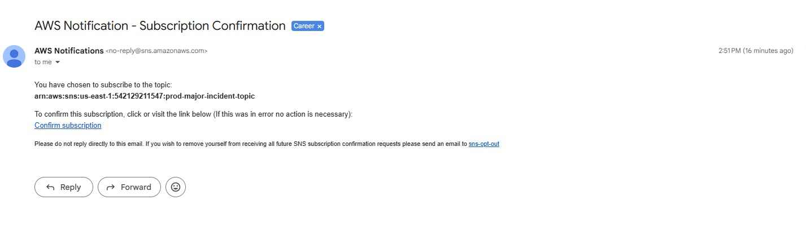
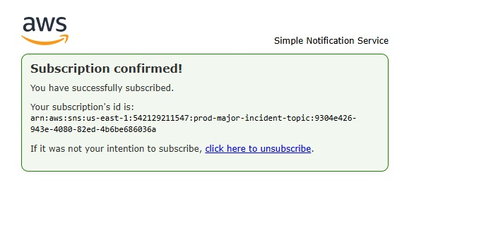
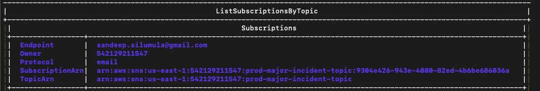
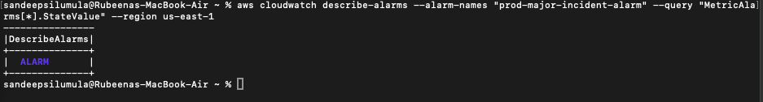
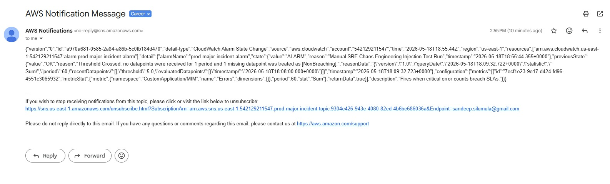
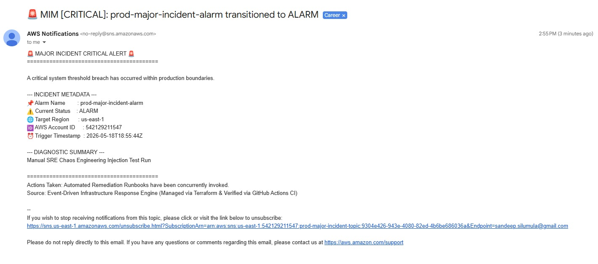
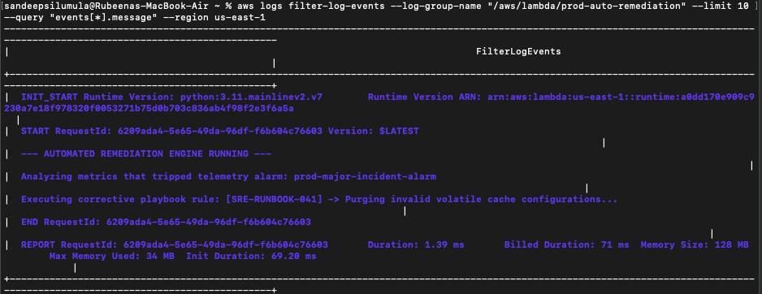

# Enterprise-Scale Event-Driven Major Incident Management (MIM) Engine

An enterprise-grade, low-latency infrastructure response engine built entirely within the AWS Free Tier boundaries. This system leverages declarative configurations to isolate monitoring telemetry from downstream automation routines—reducing Mean Time to Resolution (MTTR) programmatically.

## 🏗️ AWS Infrastructure Topology

## 🔬 Live Interactive Simulation Lab

To observe the sub-second event-driven decoupling mechanics of this engine right inside your browser without needing active AWS credentials, launch the interactive control web environment:

<p align="center">
  <a href="https://sandeepsilumula.github.io/automated-mim-engine/web/simulator.html" target="_blank" style="text-decoration: none;">
    
  </a>
</p>

<p align="center" style="font-size: 0.95em; color: #64748b; font-style: italic; margin-top: 15px;">
  (Click the failure injection button inside the web app to trace live metric state changes, parallel EventBridge fan-out configurations, and automated runbook executions concurrently.)
</p>

---

## 🛠️ Core Engineering Principles Implemented
* **Blast Radius Isolation**: Observability metrics injection points remain entirely separate from computing resources. If a remediation lambda times out, metric monitoring continues uninterrupted.
* **Declarative Multi-Module Layout**: Infrastructure is broken out into standalone, reusable submodules to prevent monolithic state files and allow rapid deployment configurations.
* **Zero-Polling Architecture**: Replaces periodic cron checks with sub-second EventBridge rule matching, driving notification overhead down to seconds.
* **Continuous Integration Rigor**: Protected by an automated GitHub Actions pipeline executing `terraform fmt` checking and `terraform validate` logic on every push event.

---

## 📊 End-to-End System Validation & Proofs

### Phase 1: Notification Authorization Layer
To secure our communication lines, an out-of-band Amazon SNS confirmation loop was initialized via Terraform and verified via the AWS CLI.

<p align="center">
  
  
</p>

Verifying the topic state via the AWS CLI confirms that our targeted communication parameters have moved safely out of the `PendingConfirmation` stage and into an active ARN block:

```text
aws sns list-subscriptions-by-topic --topic-arn "arn:aws:sns:us-east-1:542129211547:prod-major-incident-topic"
```
<p align="center">
  
</p>

### Phase 2: Anomaly Data Injection & Alarm Triggering
To simulate a production failure pattern, a sample anomaly data packet was injected using the AWS CLI toolset. CloudWatch intercepted the metric count spike, driving the telemetry state into **ALARM**:

```text
aws cloudwatch describe-alarms --alarm-names "prod-major-incident-alarm"
```
<p align="center">
  
</p>

### Phase 3: Decoupled Concurrent Fan-Out Execution
Upon state alteration, the Amazon EventBridge bus immediately intercepted the alarm payload and distributed execution tasks concurrently to all decoupled downstream systems:

#### Target A: Direct SNS Raw Event Payload
The raw metrics string payload was passed directly to the standby on-call alerting engineers:
<p align="center">
  
</p>

#### Target B: Python Diagnostic Parsing Engine
Concurrently, the `email-diagnostic-router` Lambda parsed the raw payload variables into a clean, human-readable triage report template:
<p align="center">
  
</p>

#### Target C: Self-Healing Runbook Mitigation (MTTR: 1.39ms)
Concurrently, the `auto-remediation` Lambda initialized and executed corrective runbook tasks (`[SRE-RUNBOOK-041]`) to flush corrupt cache variables, mitigating system degradation automatically:
<p align="center">
  
</p>

---

## 🚀 How to Run Locally

1. Initialize directories: `cd environments/prod && terraform init`
2. Validate syntax hooks: `terraform validate`
3. Launch infrastructure map: `terraform apply -auto-approve`
4. Tear down infrastructure boundaries: `terraform destroy -auto-approve`
